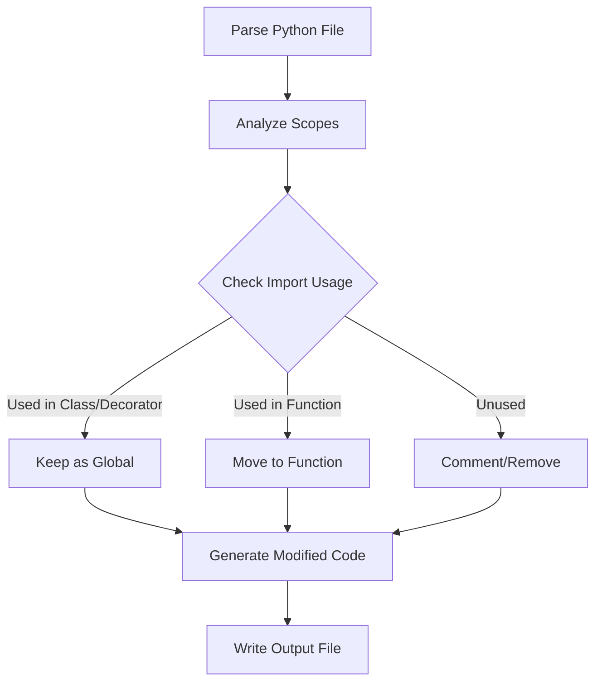

# Import Mover

"Refactoring" tool that moves Python imports into the functions where they are used. Might help reducing namespace pollution and cold launch time if libraries are lazy loaded. Not guaranteed to work for all cases.
## Dependencies
- [libcst](https://github.com/Instagram/LibCST)
 
## Features
- Moves imports into their usage scope
- Preserves imports used in class definitions and decorators
- Preserves docstrings
- Comments out or removes unused imports (this is a little hacky, but shold work)
- Detailed logging of changes

## Usage
```bash
python import_mover.py [-h] [--log LOG] [--log-level {DEBUG,INFO,WARNING,ERROR,CRITICAL}] [-o OUTPUT] [--keep-old-imports] [--remove-unused-imports] file
positional arguments:
  file                  path to the python file to process

options:
  -h, --help            show this help message and exit
  --log LOG             file to write changes to
  --log-level {DEBUG,INFO,WARNING,ERROR,CRITICAL}
                        Set the logging level
  -o OUTPUT, --output OUTPUT
                        path to save the modified file (default is with a suffix "_im")
  --keep-old-imports    keep old imports as comments (default: True)
  --remove-unused-imports
                        remove unused imports instead of commenting them (default: True)
```

## Flow



license: MIT / beerware